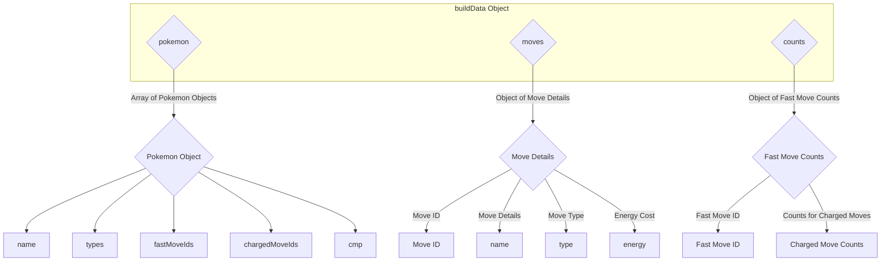

# Pokemoves Bot

## About

Pokemoves Bot is a Discord chat bot created to aid Pokemon GO PvP players, based on the [pokemoves site project](https://github.com/jamiehumphries/pokemoves) and written in node.js. A basic rundown of the PvP system is that Pokemon have a single fast move and up to 2 charged moves. Each use of the fast move generates a certain amount of energy that is used to "charge" the charged move. Knowing how many fast moves it takes for a Pokemon to generate enough energy to launch a charged move is vital information in high levels of play. This bot will take a Pokemon name as input and return the counts of how many of each fast move it will take to generate the energy for its charged moves.

## Technologies

Uses:
* Node.js v 17.0.1
* discord.js v13

## Setup

Install any necessary components

`npm install discord.js`
`npm install dotenv`

Clone this project.

Afterwards, run it locally using `node app` in the src directory. That's where the bot will be running from.

## Notes

## Credits

This bot builds on the great work of [Jamie Humphries](https://github.com/jamiehumphries), whom's site can be accessed [here](https://www.pokemoves.com/).
